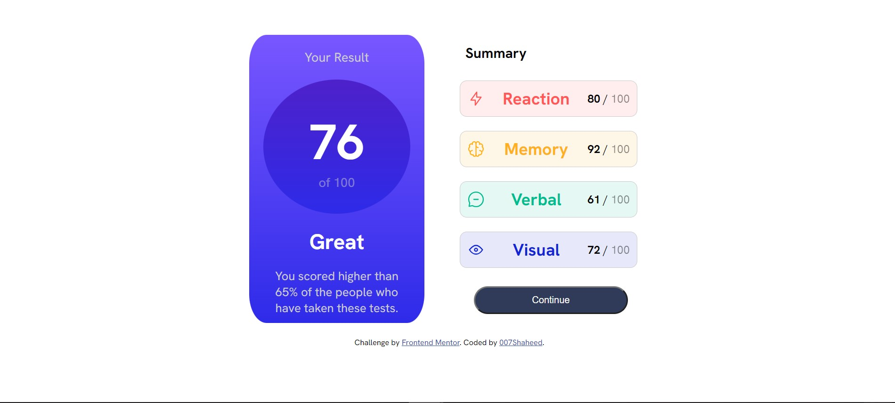

# Frontend Mentor - Results summary component solution

This is a solution to the [Results summary component challenge on Frontend Mentor](https://www.frontendmentor.io/challenges/results-summary-component-CE_K6s0maV). Frontend Mentor challenges help you improve your coding skills by building realistic projects.

## Table of contents

- [Overview](#overview)
  - [The challenge](#the-challenge)
  - [Screenshot](#screenshot)
  - [Links](#links)
- [My process](#my-process)
  - [Built with](#built-with)
  - [What I learned](#what-i-learned)
  - [Continued development](#continued-development)
  - [Useful resources](#useful-resources)
- [Author](#author)

## Overview

### The challenge

Users should be able to:

- View the optimal layout for the interface depending on their device's screen size
- See hover and focus states for all interactive elements on the page
- **Bonus**: Use the local JSON data to dynamically populate the content

### Screenshot



### Links

- Solution URL: [Add solution URL here](https://your-solution-url.com)
- Live Site URL: [Add live site URL here](https://your-live-site-url.com)

## My process

### Built with

- Semantic HTML5 markup
- CSS custom properties
- Flexbox
- CSS Grid
- Mobile-first workflow
- JS library

### What I learned

Some new features of CSS and JavaScript i've learned doing this.

```css
@media (min-width: 374px) and (max-width: 765px) {
  .box {
    max-width: 100%;
    margin: 0 auto;
    padding: 20px;
    text-align: center;
    display: flex;
    align-items: center;
    flex-wrap: wrap;
    flex-direction: column;
  }
}
```

```js
fetch("data.json")
  .then((response) => response.json())
  .then((data) => {
    const categoryCards = document.getElementById("category-cards");
    }

```

### Continued development

I'd like to continue learning more in the following:

- JavaScript in genral
- CSS flexbox
- CSS @media queries

### Useful resources

- [Example resource 1](https://youtu.be/IsC5-C_nuF4) - This helped me understand media queries.
- [Example resource 2](https://css-tricks.com/) - This will help will almost all your CSS needs.

## Author

- Website - [007Shaheed](https://www.your-site.com)
- Frontend Mentor - [@yourusername](https://www.frontendmentor.io/profile/007Shaheed)
